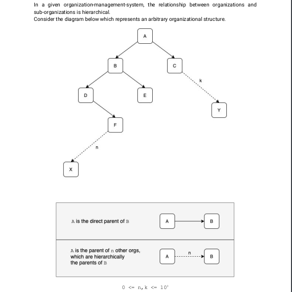

# Documentation

This is the documentation for Blue Ocean Robotics Interview with Benjamin Arko Afrasah

**Setting up Project**

- This project depends on [docker](https://docs.docker.com/engine/install/ubuntu/) and [docker-compose](https://docs.docker.com/compose/install/) to setup the cassandra database
-   Run  ```make init``` if you make  *make* installed or simply copy these commands.
    ```
    > docker network create bori-net
    > docker-compose up -d
    > docker exec -it cassandra /bin/sh -c "cqlsh -f db_scripts/db.cql"
    ```
-   Run the command below to install the project dependencies,

    ```
    yarn
    ```

-   Copy `.env.example` and rename to `.env`.
-   Set `CASSANDRA_CLUSTERS` variable to the host. Example,
    ```
    CASSANDRA_CLUSTERS=localhost
    ```
-   This projects comes with a cli. Run for access how to execute the cli
    ```
    yarn start -h
    ```
    
-   Or you can run,
    ```engine='sh'
    > yarn build
    > node bori -h
    ```

## Explanation of Algorithm
   


**Solution**

My solution was to save every child with its hierarchy tree. For example,
Considering a tree like this

Let [] - represent a hierarchy tree for a node and ****(X) - represent hierarchy of X           

            A[hierarchy: None] -    -- Root node
        |               |
        B[A]            C[A]        -- 2nd Generation
    |           |
    D[(B)$B]    E[(B)$B]            -- 3rd Generation
    |
    F[(D)$D]                        -- 4th Generation

- Taking node `B`, it's parent is node `A`
- Node `D`'s hierarchy is that of node `B` joined (`$`) with node B where the hierarchy of node `B` = A. This ends up as D = A$B
- Node `F`'s  hierarchy is that of node `D`'s hierarchy joined (`$`) with node D. `F = [hierarchy of D] $ D` => `[hierarchy of B] $B$D` => `A$B$D`.
- Hence the parents and grand parents are retrieved by splitting the hierarchy tree for node `F` by the `$` sign.
- In the case of `F` splitting the hierarchy tree `A$B$D` becomes `[A, B, D]` which are the grandparents and parents for node `F`
- Hence before an organisation is added, if it has a parent we get the hierarchy tree of the parent then add the parent to the hierarchy tree

**Cassandra Data Model**

The simplest data model for this was to create a table `organisation` with these fields: `id`, `name`, `date_added` and `hierarchypath`, where `hierarchypath` will be used to save the ancestor tree.


```
CREATE TABLE bori.organization (
    id text PRIMARY KEY,
    date_added timestamp,
    hierarchypath set<text>,
    name text
);
```

**Extra Features**
This algorithm supports more than two children for a node

**Run Tests**

    > yarn test


## How to use
Below are some examples on its usage
    
    > node bori -a org1
    output: { name: 'org1', id: '945618bd-d2b4-4eff-85ac-253c40af670f', date_added: 2020-09-30T14:17:03.207Z }

    # add organisation with parent
    > node bori -a org2 -p  945618bd-d2b4-4eff-85ac-253c40af670f
    output: { name: 'org2', id: '5075e898-9a83-4562-a8ec-c662c80c206b', date_added: 2020-09-30T14:21:19.008Z }
    
    > node bori -a org3 -p  5075e898-9a83-4562-a8ec-c662c80c206b
    output: { name: 'org3',  id: 'a004c0de-8d25-4457-862a-bb6e3e092326', date_added: 2020-09-30T14:22:58.264Z }

    > node bori -f a004c0de-8d25-4457-862a-bb6e3e092326
    output: org2, org1

## Authors

-   [Benjamin Arko Afrasah](https://github.com/Silvrash)

